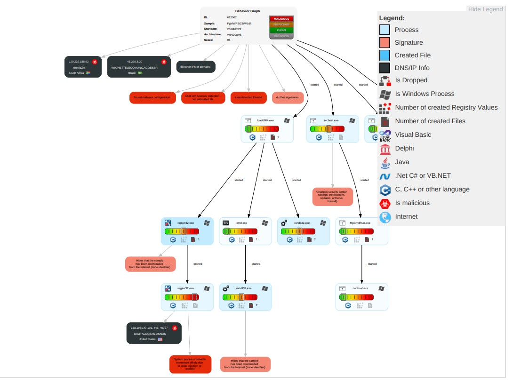

# Malware Analysis SOP

Malware analysis is the process of determining the purpose and functionality of a piece of malware. This process will reveal what type of harmful program has infected your network, the damage it’s capable of causing, and—most importantly—how to remove it. Malware analysis used to be performed manually by experts in a time-consuming and cumbersome process. Today, there are a number of open-source malware analysis tools that can perform this process automatically

Examining the capabilities of malicious software allows you to better assess the nature of a security incident, and may help prevent further infections. Here’s how to set up a controlled malware analysis lab—for free.

## Step 1: Allocate systems for the analysis lab

A common approach to examining malicious software involves infecting a system with the malware specimen and then using the appropriate monitoring tools to observe how it behaves. This requires a laboratory system you can infect without affecting your production environment. The most popular and flexible way to set up such a lab system involves virtualization software, which allows you to use a single physical computer for hosting multiple virtual systems,each running a potentially different operating system.Running multiple virtual systems simultaneously on a single physical computer is useful for analyzing malware that seeks to interact with other systems, perhaps for leaking data, obtaining instructions from the attacker, or upgrading itself. Virtualization makes it easy to set up and use such systems without procuring numerous physical boxes.

  .. Caution:: 

    This test steps for Malware analysis.

Analysis File
------------------
Perform content inspection and contextual analysis to discover sensitive data in files, and classify it based on vulnerability. Cloud protection. Track enterprise web traffic, analyze the use of shadow applications, and enforce policies to safeguard employees against inappropriate or malicious web content. FileAnalysis is part of a unified data security platform.

Behavior Analysis
---------------------

 

Dropped File 
------------------------

 
